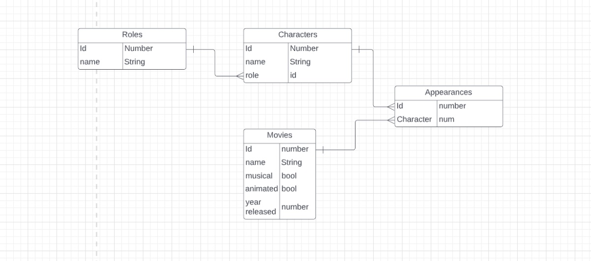

# *Project Title*

*One paragraph of project description goes here*

## Getting Started

These instructions will get you a copy of the project up and running on your local machine for development and testing purposes. See Deployment for a link to where the app is currently running.


### Prerequisites

*What things you need to install the software and how to install them*

```
Give examples
```


### Installing

*A step by step series of examples that tell you how to get a development env running*

*Say what the step will be*

```
Give the example
```

*And repeat*

```
until finished
```


## How to Use This App


______________

______________

______________ 

______________

______________


## Running the tests *(if there are any)*

*Explain how to run the automated tests for this system (if there are any)*


### End-to-end tests *(if there are any)*

*Explain what these tests test and why (if there are any)*

```
Give an example 
```

### Coding style tests *(if there are any)*


*Explain what these tests test and why  (if there are any)*


```
Give an example
```

## Deployment

This project is currently deployed at _________________________.


*Add any additional notes about how to deploy this on a live system*


## Built With

*List the languages, libraries, frameworks, and third-party services (such as deployment services) used to build the app.*

______________

______________

______________ 

______________

______________


## Authors

*List the people on your team*

______________

______________

______________ 

______________


## License

*You don’t have to add a license to your Milestone 2 Project, but you can. It is a common part of a repo that specifies how the project can be used. Kinds of licenses allowing public use are very similar but have small differences that might matter for a specific project. The MIT or GNU general license are usually fine for a public repo.*

*This project is licensed under the MIT License - see the LICENSE.md file for details*


## Acknowledgments

 - *Citing someone else's code or resources used in the project*
 - *Inspiration*
 - *etc*


## Post-MVP Plans

- *Also called stretch goals*
- *One great idea I hope to be able to add in before the project deadline.*
- *Another that will be a stretch.*
- *Something else I don't technically know how to do... *yet*. :)*

*After you finish making/deploying your app, make sure to update and finalize the README.md file for the project, which should be in the top level of your files in the repo so that it's viewable right away when a user sees the "home page" of the repo. Of course, Github and your pinned projects are one of the most important ways for you to show potential employers your skill and professionalism. Make sure there are no glaring spelling errors (this is a great extension to spell check in VSCode: https://marketplace.visualstudio.com/items?itemName=streetsidesoftware.code-spell-checker).*


*## WHEN YOU'RE READY TO SUBMIT THE PROJECT, MAKE SURE TO REMOVE ALL TEXT IN ITALICS ABOVE AND ALL TEXT BELOW THIS POINT. NOTE: THE README IS NOT JUST A PLACE TO TELL OTHERS ABOUT THE CODE IN YOUR APP, BUT IT CAN ALSO BE A PART OF THE WAY YOU PLAN AND KEEP TRACK OF YOUR PROGRESS BUILDING THE APP. ##*


## Project Planning

| Date | Goals |
| ---- | ----- |
| Sat. 2/3| Discuss project guidelines and resources; create repo and README.md for the project; teams and decide on a topic to be approved by the instructors then start working according to team git workflow process|
| Mon. 2/5| Meet in main room then hold standup meetings in breakout rooms; by break time after the first hour of class, all teams must have team members, tools and languages to use, someone assigned to be in charge of the project repo/s, and topic must be finalized; Work day in class; |     

DUE by class time on Saturday, July 1:

Each group:
- Has chosen a project idea
- Has had their project approved, 
- Has chosen/understand what tools to use for it
- Has a repo/repos set up according to best practices 
- Has agreed how the workflow is organized — at least who has ownership of the repo and is handing pull requests
- Has agreed on who is doing frontend and who is doing backend
- Has sent Chris a link to the project repo/s by Canvas email

| Date | Goals |
| ---- | ----- |
| Wed. 2/7 | Meet in main room then hold standup meetings in breakout rooms; Discuss deployment possibilities and begin preparation for it; Work day in class |
| Sat. 2/10 | Meet in main room then hold standup meetings in breakout rooms; Work day in class  |
| Mon. 2/12 | Meet in main room then hold standup meetings in breakout rooms; Your project should be deployed and all features contained in the app should work to satisfy all project requirements as shown on Canvas (or the same thing as a Google Doc: https://docs.google.com/document/d/1Rayc4cBqavZ0XV7kgMiNLs0sBL44dgafEgaAQOMgfO0/edit?usp=sharing) The same requirements are also viewable and can be duplicated as a checklist here: https://docs.google.com/document/d/1_XZd4I3_S_znzgsSt7oFbby6tMyHIQ6S4g6DaGCCimg/edit?usp=drivesdk |  
| Wed. 2/14 | Meet in main room then hold standup meetings in breakout rooms; submit your completed project. Present your project according to plan as discussed on Canvas and in class.|


## OTHER COMMON PARTS OF A PROFESSIONAL README 

## Contributing 

Please read ____________________________ for details on our code of conduct, and the process for submitting pull requests to us.


## API Endpoints

It’s common for developers to show the various endpoints in their frontend and/or backend API/s as you would find in a third-party API provider. 

This resource shows examples of different ways you can show your endpoints: https://github.com/bufferapp/README/blob/master/billing/api-endpoints.md.


## Schema Diagram

*You should likely be using a tool (an app, pen and paper, etc.) to make an ERD (Entity Relational Diagram) if you’re using a relational database or a schema diagram if you’re using a document (NoSQL) database. You can usually use the same tool for diagramming for either kind, but here are some top choices:*

*ERD: Usually the RDMS (PostgreSQL, MySQL, etc.) platform being used (PgAdmin, etc.) provides a feature to allow making diagrams from tables you’ve already made in the app.*

*How to Make an ERD Diagram in PgAdmin4.*

*Draw.io — A Common Choice for ERD Diagrams, Flowcharts, Wireframes*

*NoSQL DB Schema Modeling App: https://nosqldbm.ru/#/*


*ERD Diagram Example:* 




## REFERENCES

Markdown Writing Cheat Sheet: https://www.markdownguide.org/cheat-sheet

More Writing a Good README Resources:

https://meakaakka.medium.com/a-beginners-guide-to-writing-a-kickass-readme-7ac01da88ab3
https://silentlad.com/how-to-write-beautiful-and-meaningful-readme.md

Deep Dive into Markdown:
https://daringfireball.net/projects/markdown/syntax#philosophy


